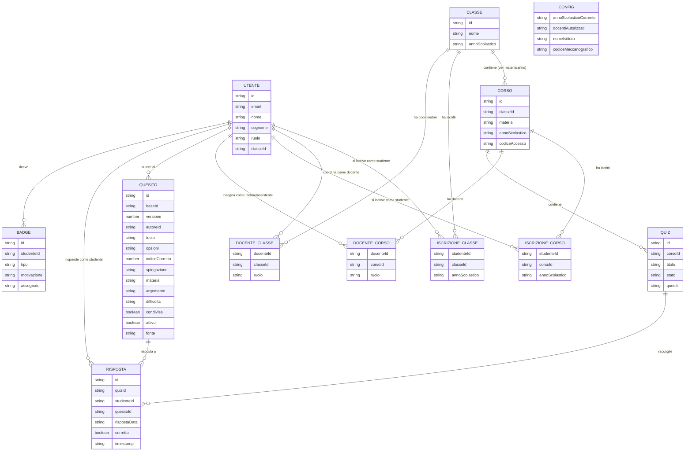

# Diagramma ERD — isaquiz

*Ultimo aggiornamento: 6 settembre 2026.*

Diagramma concettuale (mermaid) dello schema dati, versione con corsi per
materia, classi come unità amministrativa, e utente unico multi-ruolo.
Per il ragionamento dietro ogni scelta, vedi `DECISIONI_DESIGN.md`.

## Note di lettura

- **Nomi delle collezioni Firestore**: minuscolo, plurale dove naturale. Già
  create (in emulatore): `utenti`, `classi`, `corsi`, `docenti_corso`,
  `quesiti`, `quiz`, `risposte`, `codici_accesso`, `config` (documento unico
  `current`). Da creare con la stessa convenzione: `badge`, `docenti_classe`,
  `iscrizioni_corso`, `iscrizioni_classe`. Il diagramma qui sopra usa i nomi
  in maiuscolo solo come notazione ER.
- **`codici_accesso`** (non nel diagramma): id documento = un codice breve
  (Crockford Base32; lunghezza parametrica, oggi 6), valore `{ quizId, creato }`. Lo studente digita
  il codice per entrare in un quiz. Collezione a parte per il lookup diretto
  codice → quizId. **Da non confondere con `CORSO.codiceAccesso`**, che serve
  a iscriversi a un CORSO per l'anno; questo è per una singola somministrazione.
  Vedi `DECISIONI_DESIGN.md`, "Codice di accesso ai quiz".
- **`RISPOSTA`**: id documento deterministico `quizId_studenteId_quesitoId`
  (una risposta per tripla; rispondere di nuovo sovrascrive). `rispostaData`
  è la scelta grezza (`{ opzioneScelta }`); `corretta` non è scritto dal
  client (spetta a `functions/calcolaPunteggio.js` — stub: per ora il
  giusto/sbagliato è calcolato lato client).
- **`UTENTE` è una tabella sola** per studenti, docenti e amministratore. Il
  campo `ruolo` è solo la cache per la dashboard di default al login — la
  fonte di verità per un contesto specifico (un corso, una classe) è sempre
  la riga di collegamento (`ISCRIZIONE_CORSO`, `DOCENTE_CORSO`,
  `DOCENTE_CLASSE`), mai questo campo.
- **`CORSO`, non `CLASSE`, contiene i quiz.** `CLASSE` è l'unità amministrativa
  usata dal coordinatore per la vista d'insieme — schema presente da subito,
  vista aggregata cross-materia rimandata a dopo la DPIA (Fase 4/5).
- **`DOCENTE_CORSO.ruolo`** distingue titolare da assistente sullo stesso
  corso: stessa persona può essere titolare su un corso e assistente su un
  altro, sono righe indipendenti.
- **Nessuna riga viene mai sovrascritta al cambio di anno scolastico.** Nuovo
  anno, nuova promozione, nuovo ruolo (es. ex studente che torna come
  docente): si aggiungono righe, non si modificano quelle esistenti.
  `CONFIG.annoScolasticoCorrente` è il singolo valore che rende i codici delle
  annate precedenti non più validi.
- **`CONFIG.nomeIstituto` e `CONFIG.codiceMeccanografico`** identificano quale
  istituto sta "facendo girare" questa installazione — la piattaforma è
  pensata per un istituto alla volta (vedi `DECISIONI_DESIGN.md`,
  "Internazionalizzazione", "Pubblico e contesto fissi"); un secondo istituto
  significa una seconda installazione con il proprio `CONFIG`, non un campo
  di scoping sparso su tutte le altre entità.
- **`QUESITO.opzioni` e `QUIZ.quesiti` sono array**, non stringhe singole —
  mermaid non ha un tipo array nativo per gli ER diagram, quindi qui compaiono
  come `string` per limite di notazione, non perché lo siano davvero.
  `opzioni` è l'elenco delle alternative di scelta multipla; `indiceCorretto`
  è la posizione (0-based) di quella giusta dentro `opzioni`. Vedi
  `DECISIONI_DESIGN.md`, "Terminologia", sul perché non si chiamano "risposte".
- **`QUESITO.id` è `baseId` + `-v` + numero di versione**, senza padding
  (es. `xxxx-v0`, `xxxx-v1`...); `versione` è duplicato come campo numerico,
  fonte di verità per ordinamento/confronto — il suffisso nell'id è solo
  leggibilità e concatenazione, mai usato per ordinare. Un quesito non si
  modifica mai in place: la banca mostra solo l'ultima versione per
  `baseId`, i quiz esistenti referenziano l'id completo di versione
  specifica. Motivazione completa in `DECISIONI_DESIGN.md`, "Versionamento
  dei quesiti".
- **`QUESITO.attivo`** (booleano): un quesito disattivato sparisce dalla banca
  ma resta risolvibile per id (quiz storici). Metadato, si scrive in place
  (non crea una nuova versione). **Regola di lettura: `attivo !== false`** —
  un documento senza il campo (dati pre-esistenti) è attivo; mai
  `attivo === true`. Vedi `DECISIONI_DESIGN.md`, "Disattivazione dei quesiti".
- **`QUESITO.fonte`** è nello schema ma il suo significato non è ancora
  fissato: tutte le scritture attuali lo lasciano a `"manuale"`. Vedi
  `DECISIONI_DESIGN.md`, "Stati del quiz".
- **`QUIZ.stato`** è un enum: `bozza` → `attivo` ⇄ `chiuso` → (eventuale)
  `archiviato`. `bozza` è modificabile e cancellabile; da `attivo` in poi il
  contenuto è immutabile. `attivo` accetta risposte; `chiuso` no (reversibile
  con `riapriQuiz`). Dettaglio in `DECISIONI_DESIGN.md`, "Stati del quiz".
