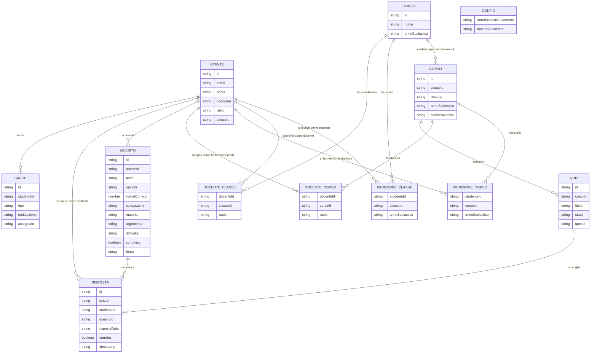

# Diagramma ERD — isaquiz

*Ultimo aggiornamento: 27 agosto 2026.*

Diagramma concettuale (mermaid) dello schema dati, versione con corsi per
materia, classi come unità amministrativa, e utente unico multi-ruolo.
Per il ragionamento dietro ogni scelta, vedi `DECISIONI_DESIGN.md`.

## Note di lettura

- **`UTENTE` è una tabella sola** per studenti, docenti e amministratore. Il
  campo `ruolo` è solo la cache per la dashboard di default al login — la
  fonte di verità per un contesto specifico (un corso, una classe) è sempre
  la riga di collegamento (`ISCRIZIONE_CORSO`, `DOCENTE_CORSO`,
  `DOCENTE_CLASSE`), mai questo campo.
- **`CORSO`, non `CLASSE`, contiene i quiz.** `CLASSE` è l'unità amministrativa
  usata dal coordinatore per la vista d'insieme — schema presente da subito,
  vista aggregata cross-materia rimandata a dopo la DPIA (Fase 4/5).
- **`DOCENTE_CORSO.ruolo`** distingue titolare da assistente sullo stesso
  corso: stessa persona può essere titolare su un corso e assistente su un
  altro, sono righe indipendenti.
- **Nessuna riga viene mai sovrascritta al cambio di anno scolastico.** Nuovo
  anno, nuova promozione, nuovo ruolo (es. ex studente che torna come
  docente): si aggiungono righe, non si modificano quelle esistenti.
  `CONFIG.annoScolasticoCorrente` è il singolo valore che rende i codici delle
  annate precedenti non più validi.
- **`QUESITO.opzioni` e `QUIZ.quesiti` sono array**, non stringhe singole —
  mermaid non ha un tipo array nativo per gli ER diagram, quindi qui compaiono
  come `string` per limite di notazione, non perché lo siano davvero.
  `opzioni` è l'elenco delle alternative di scelta multipla; `indiceCorretto`
  è la posizione (0-based) di quella giusta dentro `opzioni`. Vedi
  `DECISIONI_DESIGN.md`, "Terminologia", sul perché non si chiamano "risposte".
